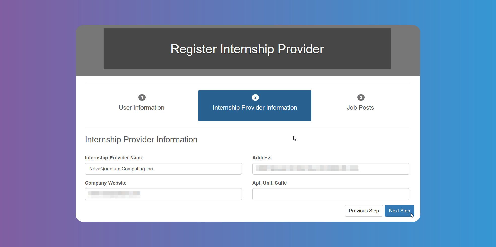

# Getting Started

## Registering as an Internship Provider

Welcome to GetMyInterns! This guide will help you take your first steps.

Click on **_Register_** and then on `Internship Providers` to create your account. Fill in the required data as shown on the pictures below.

You can add more than one `Job` post clicking on the yellow button.

An `Admin User` can also sign you up, in which case you will receive an email.

:::info

Your account will remain in pending status until an Administrator reviews your information and approves you.

:::

## How to Set Up Your Provider Profile

After registering, you may need to choose a [`Season`](/glossary#season) to apply to, if there are more than one active `Season` available.

To apply to more than one `Season`, just click on the active one on the menu bar at the top of the screen and choose. Once you have chosen the `Seasons`, or if there was just one active `Season`, please wait to be approved to start using the platform.

Once you have been approved, you will gain access to hire interns.

Click on **_My Info_** to edit your info or reset your password if needed.

In the **_Forms_** page you will find any forms and documents related to the program.

The **_Job Posts_** page will show you the `Job` posts you have already filled in for the chosen `Season`, and you can see and edit the details of each one by clicking on their title. You can add new ones by clicking on **_Add Job_**. Use the filter to toggle between `Seasons` if you have applied to more than one, or narrow your search.

:::info

`Industry` is the field of the `Job` offered or of the company/organization. You can use this to let the `Student` know in which field they will be carrying out their duties.

:::
