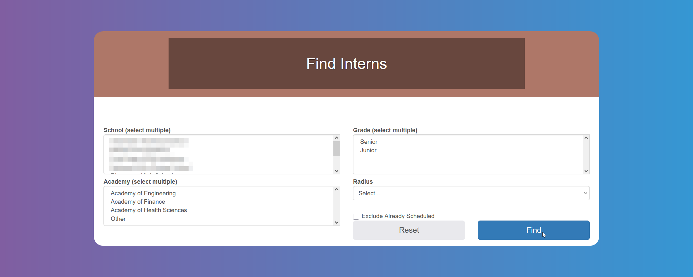

# Finding and Managing Interns

In order to apply for internships the `Account Administrator` needs to approve you after [registering](/internship-providers/getting-started#registering-as-an-internship-provider).

:::info

If you have applied for more than one `Season`, you can toggle between active `Seasons` from the top menu.

:::

## How to Search for Interns and Offer Jobs

Click on **_Hire - Find Interns_**. You can select `School`, [`Area of Study`](/glossary#area-of-study), Grade, Radius and exclude `Students` who you already scheduled an interview or offered an `Internship`. For multiple selection, press the Ctrl or Shift key or CMD, depending on your device.

You will see a list of Students who have applied to one of your `Jobs`. You will also receive an email when a `Student` applies.

You can schedule an `Interview`, offer the `Job` directly or **_Reject_** the application, from the buttons on the right.

Clicking on **_Offer Job_** or **_Reject_** will prompt a confirmation message.

## Tracking Your Job Offers

Click on **_Hire - Job Offers_** to see a list with their statuses.

You can reject the offer by clicking on the red button to the right.

The student will receive an email letting them know the offer has been withdrawn.

## My Interns

Click on **_Interns - My Interns_** on the menu to see a list of `Students` already hired.
