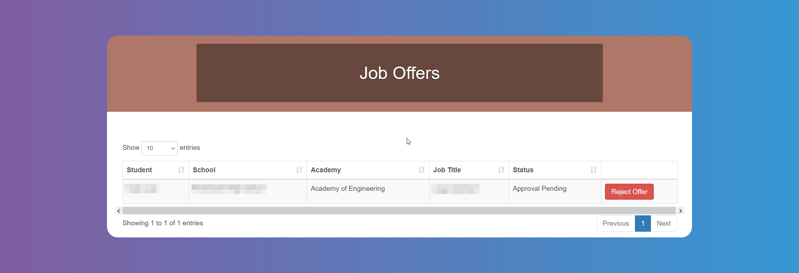

# Finding and Managing Interns

## How to Search for Interns and Offer Jobs

Click on **_Hire - Find Interns_**. You can select `School`, `Area of Study`, Grade, Radius and exclude already scheduled `Students`. For multiple selection, press the Ctrl or Shift key or CMD, depending on your device.

:::info

The `Area of Study` is a category or field in which students focus their academic and internship pursuits. Different schools/districts have different names for it. Some schools/districts call them `Academies`, `Pathways`, `Tracks`, `Concentrations`, etc. In the picture above it's called `Academy`.

:::

You will see a list of Students who have applied for your `Job` offer. You will also receive an email when a `Student` applies.

You can schedule an `Interview`, offer the `Job` directly or **_Reject_** the application, from the buttons on the right.

When scheduling an `Interview`, you will see the `Student's` availability, and you can choose location, date and time.

:::info

`Event` in the **_Schedule_** `Internship` screen refers to any event in which `Internship Providers` can participate to interview `Students`. When scheduling interviews the active `Events` will appear as an option to hold the interviews.

:::

Clicking on **_Offer Job_** or **_Reject_** will prompt a confirmation message.

## How to Accept or Decline Internship Applications

Click on **_Hire - Find Interns_**. You will see a list of Students who have applied for your `Job` offer.

You can schedule an `Interview`, offer the `Job` directly or **_Reject_** the application, from the buttons on the right.

When scheduling an `Interview`, you will see the `Student's` availability, and you can choose location, date and time.

:::info

`Event` in the **_Schedule_** `Internship` screen refers to any event in which `Internship Providers` can participate to interview `Students`. When scheduling interviews the active `Events` will appear as an option to hold the interviews.

:::

Clicking on **_Offer Job_** or **_Reject_** will prompt a confirmation message.

## Tracking Your Job Offers

Click on **_Hire - Job Offers_** to see a list with their statuses.

You can reject the offer by clicking on the red button to the right.

You will receive an email when the offer is approved or declined.