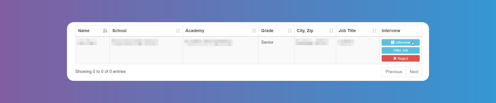
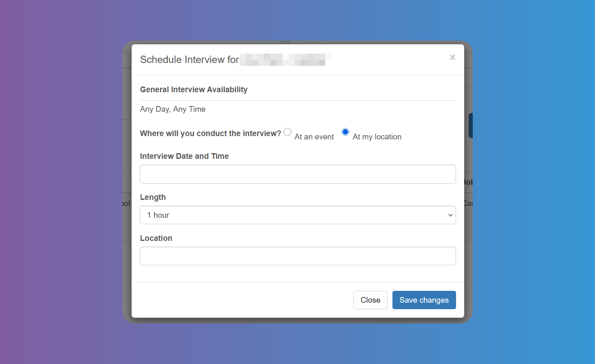

# Interviews

## How to Schedule Interviews with Students

Click on **_Hire - Find Interns_**. You can select `School`, `Area of Study`, Grade, Radius and exclude already scheduled `Students`. For multiple selection, press the Ctrl or Shift key or CMD, depending on your device.

:::info

The `Area of Study` is a category or field in which students focus their academic and internship pursuits. Different schools/districts have different names for it. Some schools/districts call them `Academies`, `Pathways`, `Tracks`, `Concentrations`, etc. In the picture above it's called `Academy`.

:::

You will see a list of Students who have applied for your `Job` offer.

You can schedule an `Interview`, offer the `Job` directly or **_Reject_** the application, from the buttons on the right.

When scheduling an `Interview`, you will see the `Student's` availability, and you can choose location, date and time.

The `Student` will receive an email with the details. You will receive an email if the interview is cancelled.

:::info

`Event` in the **_Schedule_** `Internship` screen refers to any event in which `Internship Providers` can participate to interview `Students`. When scheduling interviews the active `Events` will appear as an option to hold the interviews.

:::

## Tracking your Interviews

