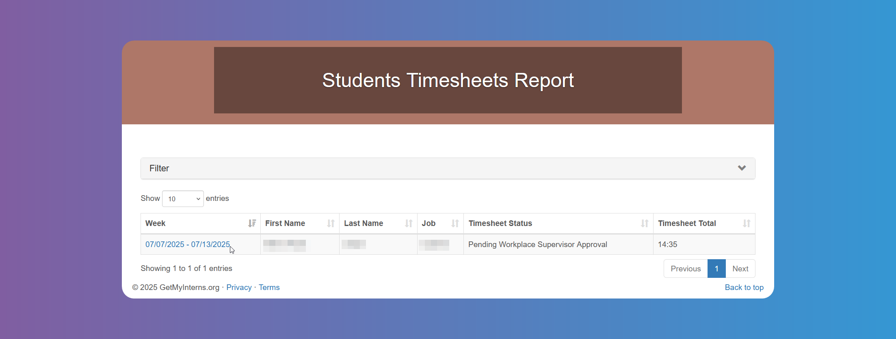

# Timesheets and Evaluations

## How to Review and Approve Student Timesheets

Toggle between active `Seasons` from the menu above, if you have applied for more than one.

Click on **_Interns - Timesheets_** to get a list of `Timesheets` and their statuses.

Tap on the date in the **_Week_** column to open the details. You can approve or reject the Timesheet, and add notes if needed. If rejected, the `Student` will receive an email.

## How to Fill Out Student Evaluations

Toggle between active `Seasons` from the menu above, if you have applied for more than one.

Click on **_Interns - Evaluations_** to get a list of your `Interns` and fill out their `Evaluations` by clicking on the edit icon on the **_Evaluation_** column. Remember to click on Save before closing.

Click on the file icon on the **_Evaluation_** column to see previously filled out `Evaluations`.

Please contact the school internship supervisor if you have any doubts about how to fill out the specific questions on the `Evaluations`.
