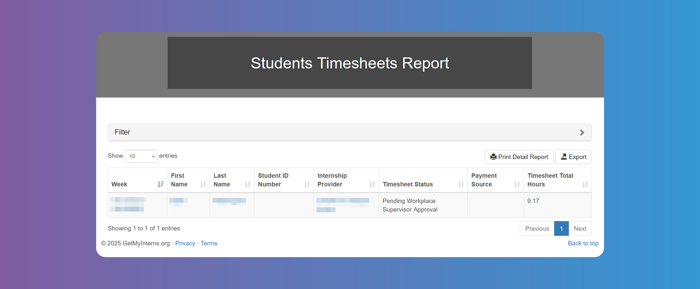
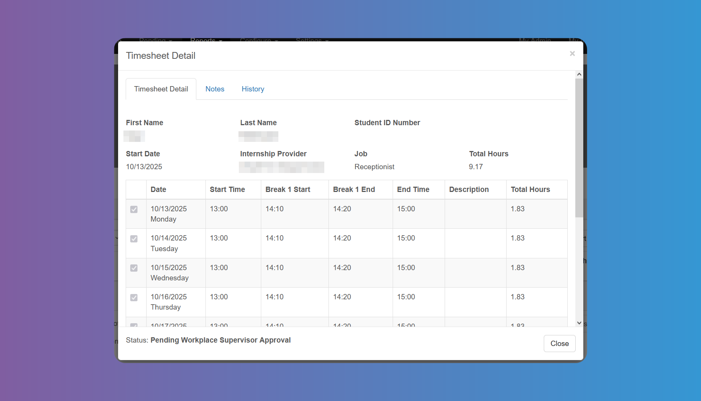
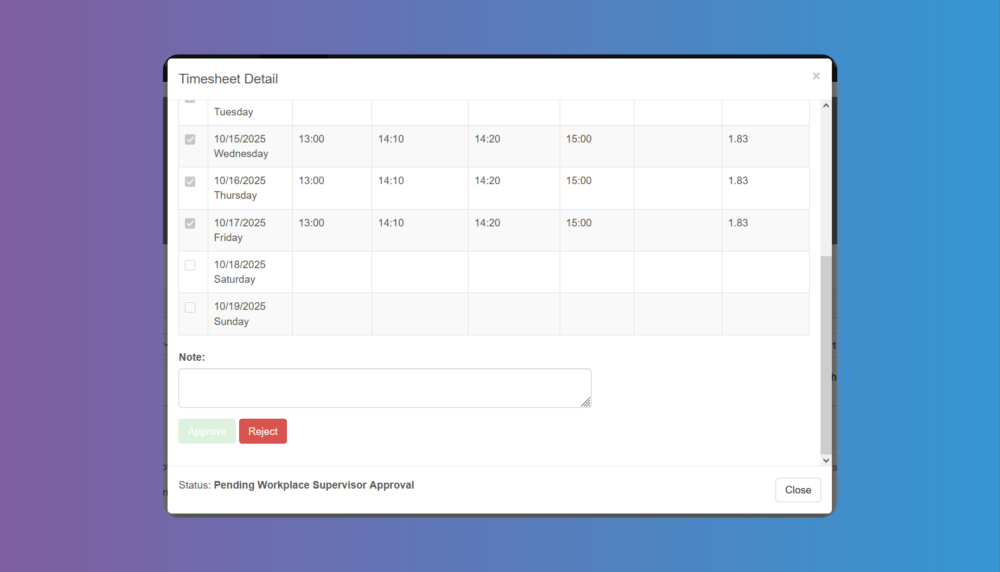
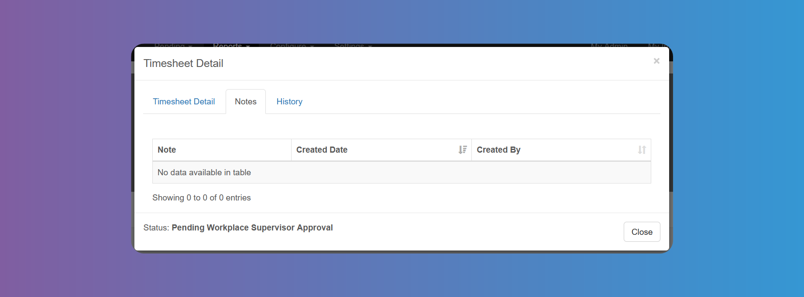
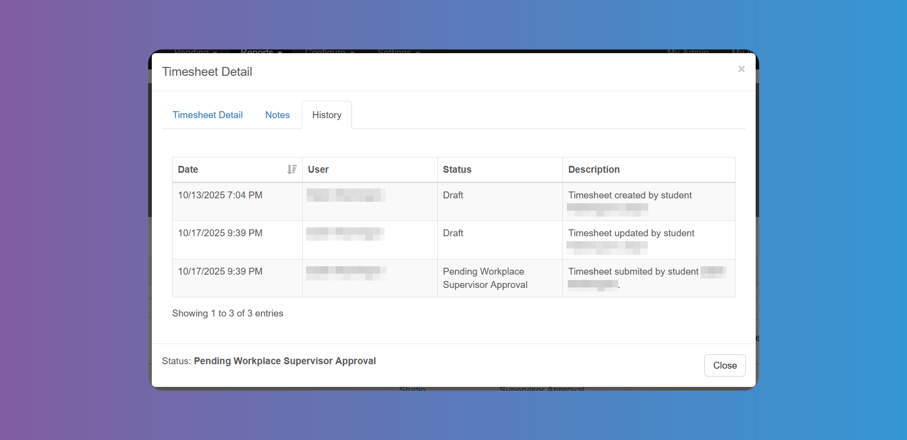

# Timesheets

You can access a list and details of the `Timesheets` from **_Reports - Students Timesheets_**. This report shows all the `Timesheets` in the system. You can use the many filter fields to search and view `Students Timesheets`, as long as you have chosen to **_Enable_** them from the [Settings-Timesheets](/school-admins/settings#timesheet-settings). You can also toggle between active `Seasons` from the filter.

You can see the total hours worked for each week on the last column.

:::warning

If you have chosen that a school supervisor needs to approve `Timesheets` from the [Timesheet Settings](/school-admins/settings#timesheet-settings), whether alone or with a workplace supervisor, be sure to edit the `Student`'s details and enter the supervisor in the respective field (see photo 2 on [Students Details Modal](/school-admins/students-details-modal)). Likewise, if you have chosen that a workplace supervisor needs to approve `Timesheets` from the [Timesheet Settings](/school-admins/settings#timesheet-settings), whether alone or with a school supervisor, be sure to edit the `Internship`'s details and enter the supervisor in the respective field (see photo 2 on [Internships](/school-admins/internships)).

:::

Tapping on the dates at the **Week** column will open the `Timesheet` details for that week.

Bear in mind the fields appearing in the photo above may vary according to your [Settings](/school-admins/settings#timesheet-settings).

You can see any notes written by a supervisor on the box below the table. You can **_Approve_** or **_Reject_** the `Timesheet` from the button at the bottom.

Below you will find the status.

Tap on the **Notes** tab to see any notes created by a supervisor and the date.

On the **History** tab you can see the actions taken and their dates, as well as the status.

