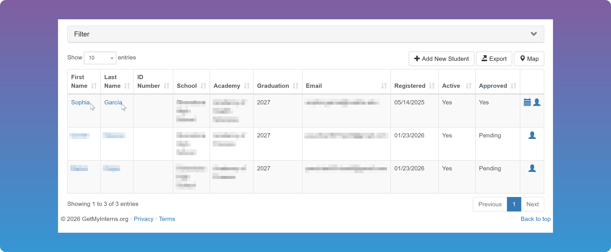
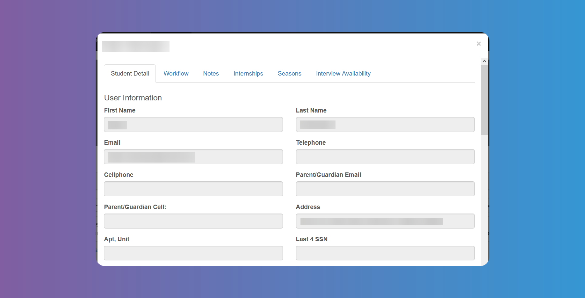
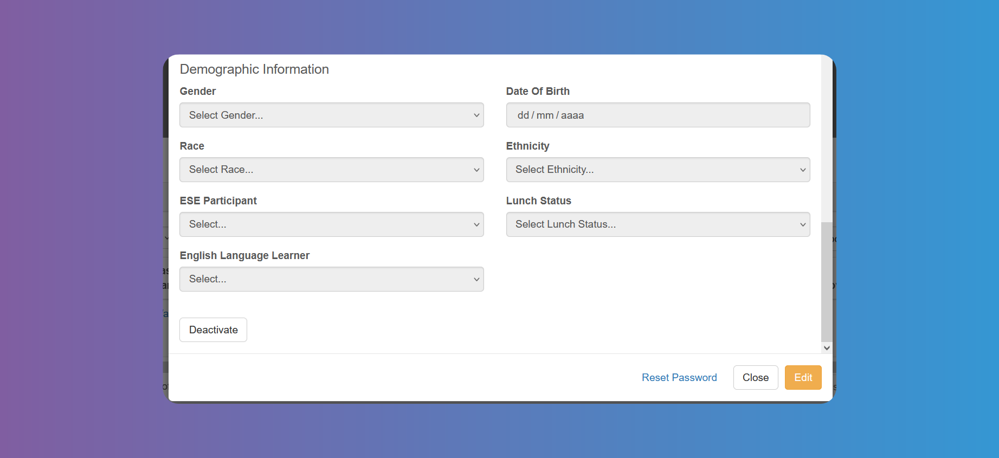
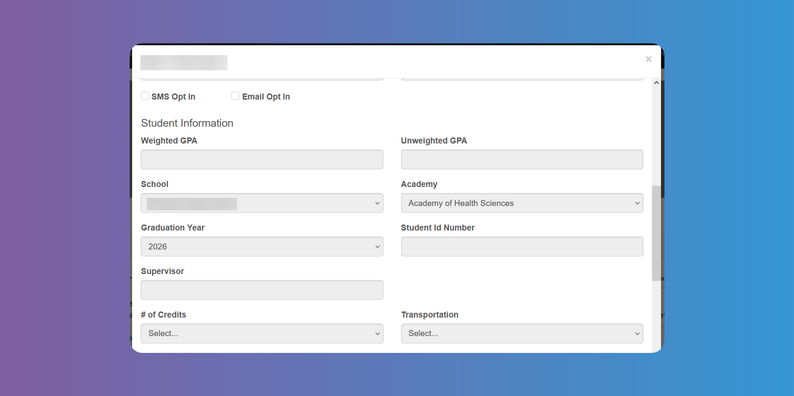
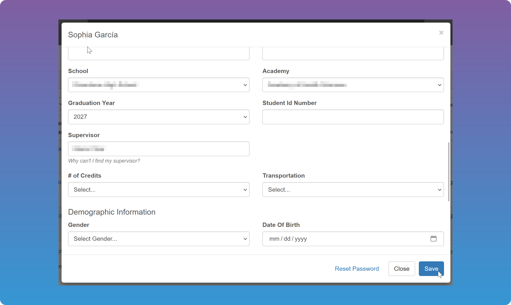
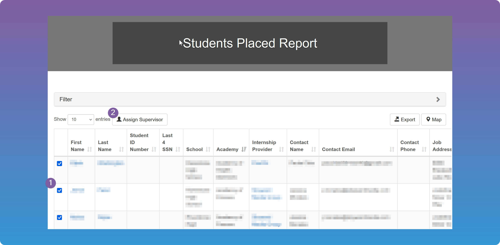
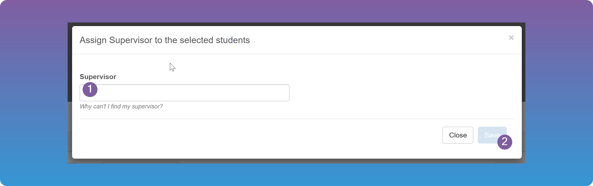
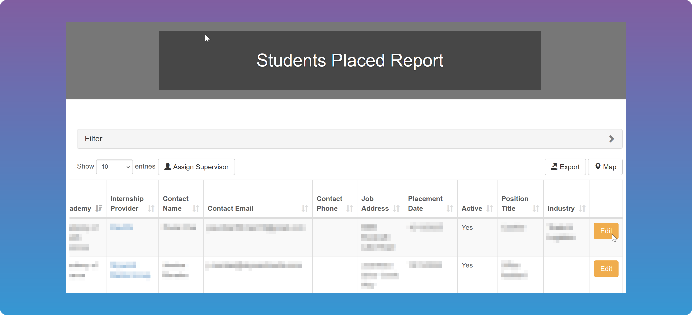
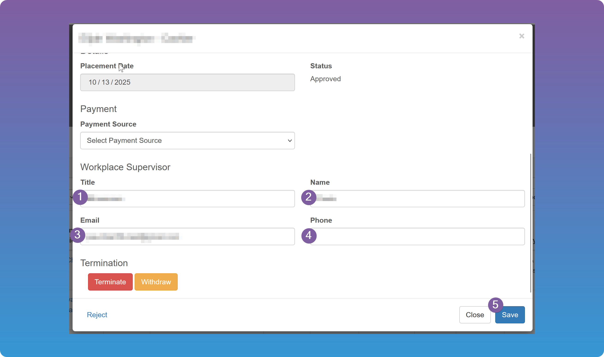

# Assigning Supervisors

Depending on your [Timesheet Settings](/school-admins/settings/timesheet-settings), `Timesheets` may need to be approved by a school supervisor, a workplace supervisor, or both. Before `Timesheets` can be processed, the relevant supervisor must be assigned in the system.

## School Supervisor

### Manual assignment

The school supervisor is assigned on the [Students details modal](/school-admins/students-details-modal).

1. Open the `Student`'s details by tapping on their name anywhere on the platform.

2. Go to the first tab **Student Detail** and tap on the yellow button **_Edit_**.

 

3. Enter the supervisor in the **School Supervisor** field.

4. Save the changes.

### Batch assingment

You can also batch assign supervisors from [Reports - Students Placed](/school-admins/reports#students-placed-report) by checking multiple students and clicking on the **_Assign Supervisor_** button. This will assign the student the chosen supervisor, which will give them access to the Student as well as the ability to filter all their students they are assigned to. You can use the filters to list the `Student` you need to assign the same supervisor to. The workplace supervisor will receive an email with a link to be able to review and approve/reject the `Timesheet`.

 

## Workplace Supervisor

If the workplace supervisor is a different person than the Account owner, you need to assign them on the `Internship` record.

1. Go to **_Reports - Students Placed_** and tap **_Edit_** on the relevant `Internship` (last column).

2. Scroll down to the workplace supervisor section and fill in the supervisor's data (see [Internships](/school-admins/internships)).
3. Save the changes.

:::warning

If this is the case and no supervisor was assigned, the `Timesheet` will get stuck in the approval process, unless the Account owner intervenes.

:::
