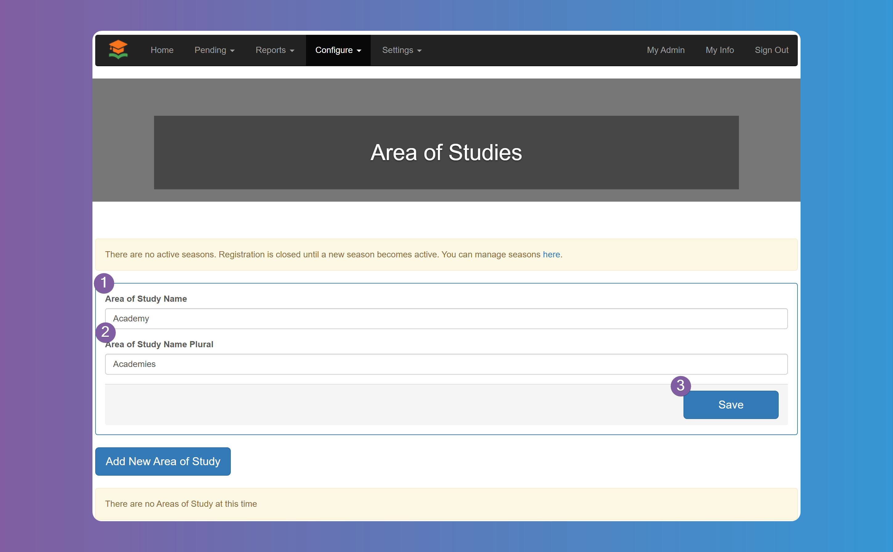
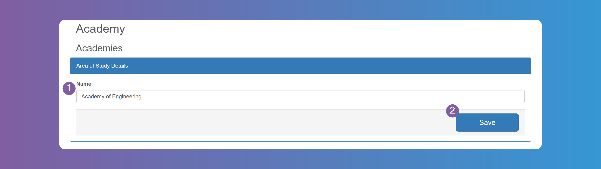
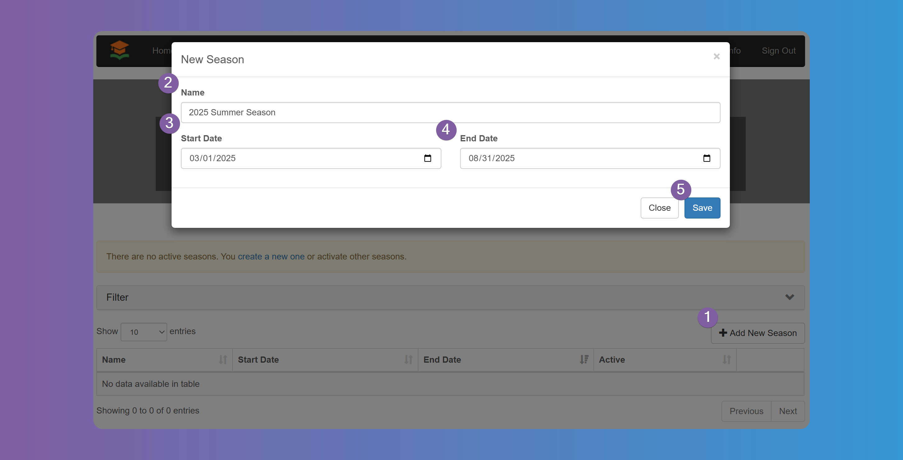
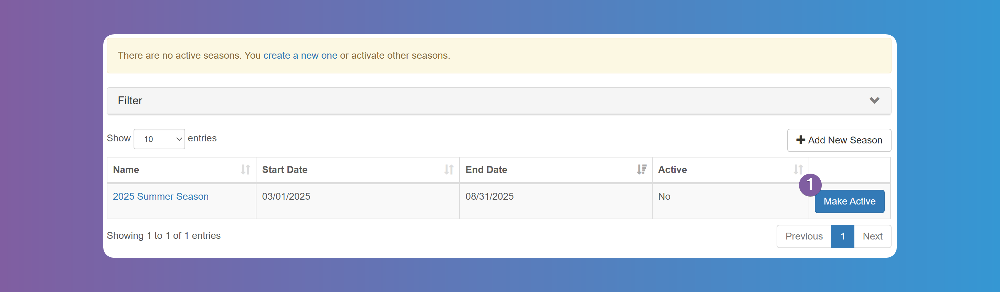

# Getting Started

## Welcome to GetMyInterns: A Guide for School & District Administrators

Welcome to GetMyInterns! As a school or district administrator, you're responsible for overseeing and managing your internship program. This includes configuring your settings, running reports, and managing user access. This guide will help you take your first steps.

---

## How to Set Up Your School or District Account

### 1. Log In to Your Admin Dashboard

Once your account is created, you’ll receive a welcome email with your login credentials. Click on the link in the email and login using your email and unique password that was generated for you. You can change the password by clicking on **_My Info_** > **_Reset Password_**

### 2. Configure Area of Study

The `Area of Study`, a category or field in which students focus their academic and internship pursuits, should be the first thing you configure. At least one `Area of Study` is required. Since different schools/districts have different names for it, you can configure the name first. Some schools/districs call them `Academies`, `Pathways`, `Tracks`, `Concentrations`, etc. You will need to configure the singular and plural name for it first by going to **_Configure_** > **_Area of Studies_**

Next you need to add at least one `Area of Study` as it is a required field for when students sign up. You can have as many as you need. In the next step you will relate these `Area of Studies` to each `School`. Click on **_Add New Area of Study_** button, fill in the name, and click **_Save_**. Repeat this steps for as many `Areas of Studies` you need.

### 3. Configure Schools

Next up are all the schools that participate in your internship program. You need to add it one by one and relate it to each `Area of Study` you added in the previous step. Go to **_Configure_** > **_Schools_** and press **_Add New School_**.

Enter the Name and Address, select the `Area of Studies` that this school is related to and specify the coordinator's email, name, and phone number for that `Area of Study` in that `School`. The email is used to let the coordinator know of every interview each student is scheduled for. Note that these values are optional and you can leave blank. When all done, click on **_Save_**. Repeat the steps for each school in your district.

:::info

Each `School` requires at least one `Area of Study` related to it. If some schools don't have an `Area of Study` you can create a generic `Other`, `Unknown`, etc `Area of Study` and relate it to that `School`.

:::

### 4. Configure Seasons

`Seasons` are a designated period for internships. `Students`, `Internship Providers`, `Internships`, and everything related to them happens within the `Season`. `Students` and `Internship Providers` need to apply to each new `Season` in order to be able to participate within that period.

:::warning

The system requires to have at least one active `Season` in order for `Students` and `Internship Providers` to be able to register. If there isn't an active `Season` then registration is automatically disabled.

:::

To add a new `Season` go to **_Configure_** > **_Seasons_** and click on the **_Add New Season_** button. Specify a Name, Start and End Date.

:::info

The dates are not the dates the `Internships` take place, but rather the dates you want the users to start registering, want to find `Internships` and `Students` all the way through the actual `Internship` when `Students` submit `Timesheets` and `Providers` provide their `Evaluations`.

:::

After you have added the `Season`, you need to make it active by pressing the **_Make Active_** button.

:::info

You can only make a `Season` active as long as the dates are within today's date.

:::

:::info

You can have multiple `Seasons` active at the same time. Some Schools/Districts want to have `Seasons` overlap so `Students` can start registering for the next `Season` while the current `Season` is ongoing.

:::

### 5. Other Configurations

Those are the minimum required configurations you need in order to get started, but you will want to configure your instance of GetMyInterns in more details to match your own workflow and needs.

...

---

## Navigating the Admin Dashboard

The admin dashboard provides a clear view of your internship program at a glance:

- **Pending Items**: Quickly review students, providers, or offers requiring attention.
- **Reports**: Access detailed analytics on placements, timesheets, payroll, evaluations, and more.
- **User Management**: Add or remove admin users with role-based access.
- **Configuration Shortcuts**: Quickly jump to workflows, settings, and reports from the left navigation panel.

To learn more about specific areas of the dashboard, check out our [Admin Reports Guide](#), [System Configuration Guide](#), and [Timesheet Setup Help](#).

---

Need help? Visit the [Help Center homepage](https://help.getmyinterns.org) or contact us at [support@getmyinterns.org](mailto:support@getmyinterns.org).
