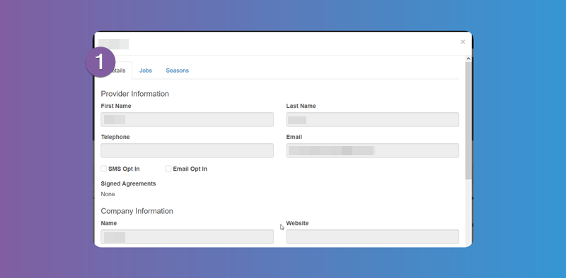
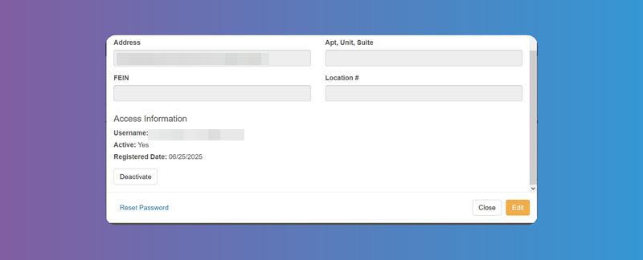
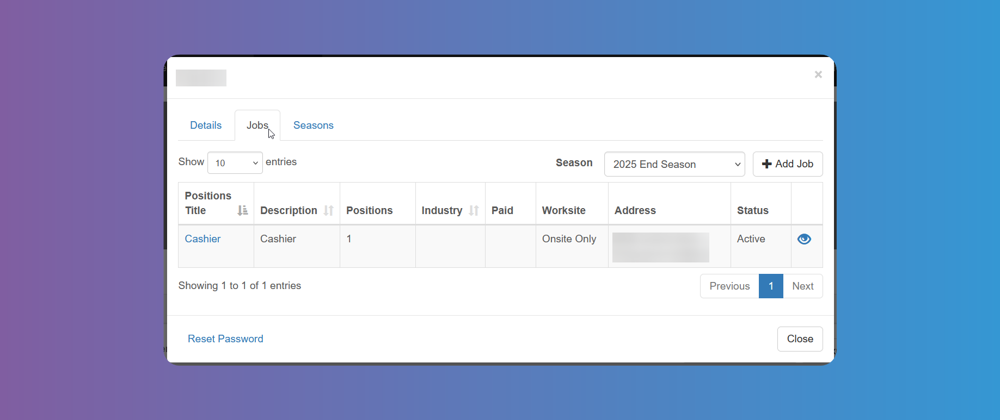
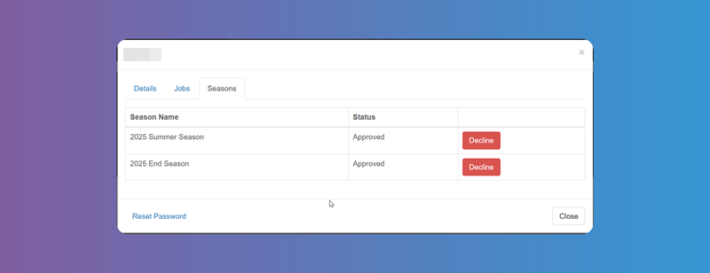

# Internship Providers Details Modal

Tapping on the `Internship Provider`'s name anywhere on the platform where they appear clickable, will open the `Internship Provider`'s details with different tabs.

In the first tab you can view and **_Edit_** the `Internship Provider`'s details according to the fields you have chosen on [System Configuration](/school-admins/system-configuration#configurable-provider-fields).

In the `Jobs` tab you can see a list of `Jobs` offered by the `Internship Provider`. `Account Admins` can add a new `Job`. Tapping on the **_Position Title_** will show you the `Job`'s details, which `Account Admins` will be able to **_Edit_**. The eye icon at the last column will allow `Account Admins` to hide the `Job` offer from `Students`, if needed.

From the `Seasons` tab you can **_Approve_** or **_Decline_** the `Internship Provider` for each active `Season`.

At the bottom of the window you have the button to **_Reset Password_**, if needed.
