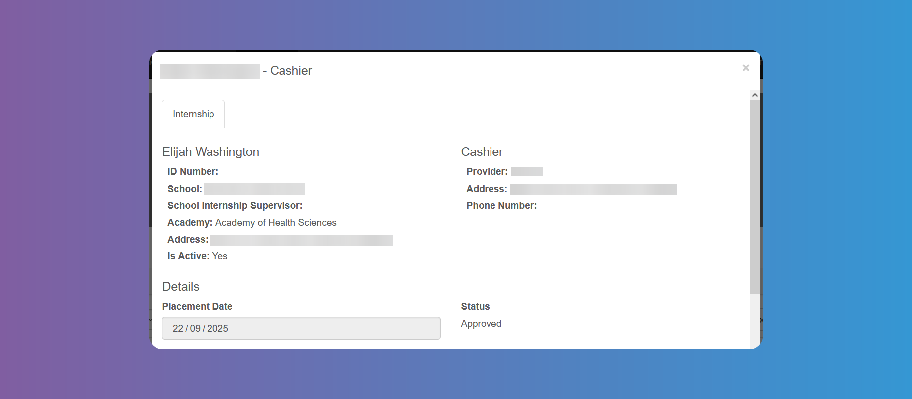
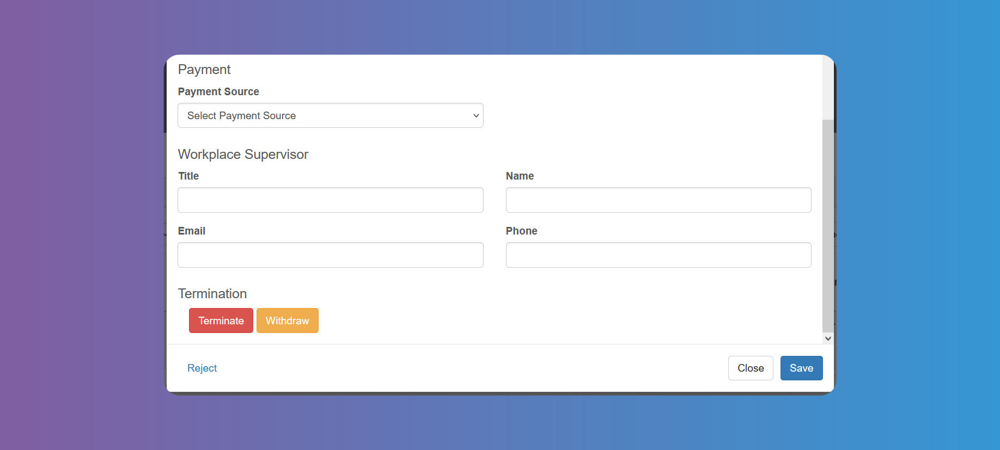

# Internships

You can access the details of an `Internship` from **_Reports - Students Placed_**. Tap on the **_Edit_** button on the last column.

On the left you will find the data of the `Student`, such as ID number, school, school supervisor, area of study, address and if the `Internship` is active.

On the right you will find the `Job` post, `Internship Provider` name, address and phone number.

Below you will find the placement date and status.

For the **_Payment Source_** you can choose one of 3 options: Employer, Community Hours or Grant.

You can fill in the workplace supervisor data below.

At the bottom you will find the buttons to **_Terminate_** or **_Withdraw_** the `Internship`.

