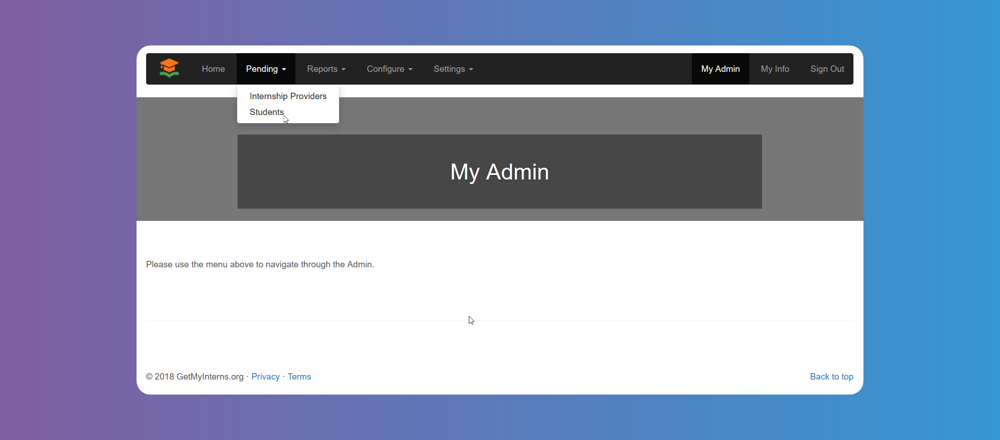
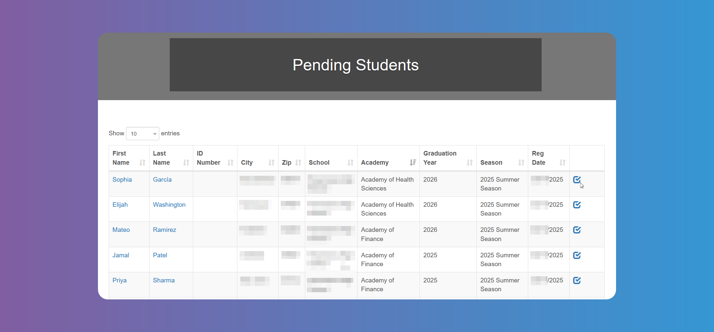
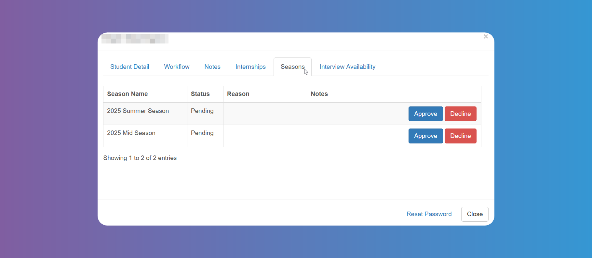
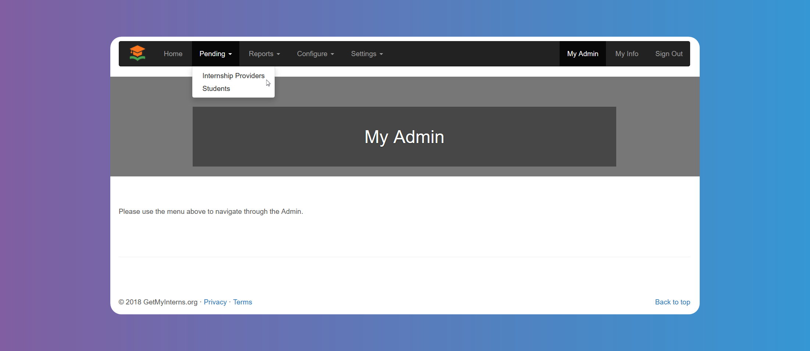
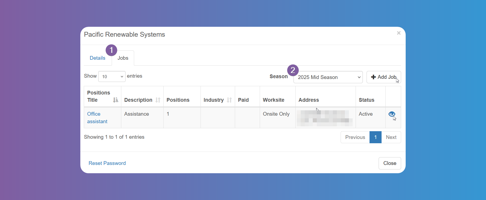

# Managing Users

## How to Review and Approve Student Accounts

:::warning

This step is only necessary if you have activated it from **_Settings_** > **_General Settings_**. (See [Settings - General Settings](/school-admins/settings#general-settings) for more info). **If not activated, students will be able to open an account and directly use the app**.

:::

**i.** Click on **_Pending_** > **_Students_**.

You can use the filter to choose between active `Seasons`.

**ii.** Click on the icon to the right of the student to be approved.

:::info

Tap on either the First Name or Last Name of the student to review and edit data such as students `Details`, `Workflow`, `Seasons`, etc. (see [System Configuration](/school-admins/system-configuration) for more info)

:::

The students need to be approved for each active season they have applied to, either from the list of students, since each student will appear once for each season he has applied to, or from the `Seasons` tab.

## How to Review and Approve Internship Providers

:::info

You can choose other admins to also approve an `Internship Provider` from **_Settings_** > **_General Settings_**. (See [Settings - General Settings](/school-admins/settings#general-settings) for more info). If so, any of the selected admins will be able to approve `Internship Providers`.

:::

**i.** Click on **_Pending_** > **_Internship Providers_**.

You can use the filter to choose between active `Seasons`.

**ii.** Click on a name from the list to review, edit, approve or decline.

-The `Internship Provider` needs to be approved for each active `Season` it has applied to, either from the list of providers, since it will appear once for each season it has applied to, or from the `Details` tab.

-Jobs can be reviewed from the `Jobs` tab, as well as add a new one. They can also be hidden from students view if necessary. Tapping on an existing job title will allow editing.

:::info

After approving or declining, the provider's status can be changed from **_Reports_** > **_Internship Providers_** (see [Reports - Internship Providers](/school-admins/reports#how-to-run-the-internship-providers-report) for more info) or from any other field where the Internship Provider's name appears clickable.

:::
