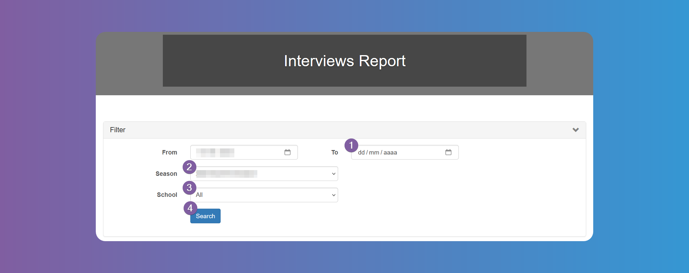
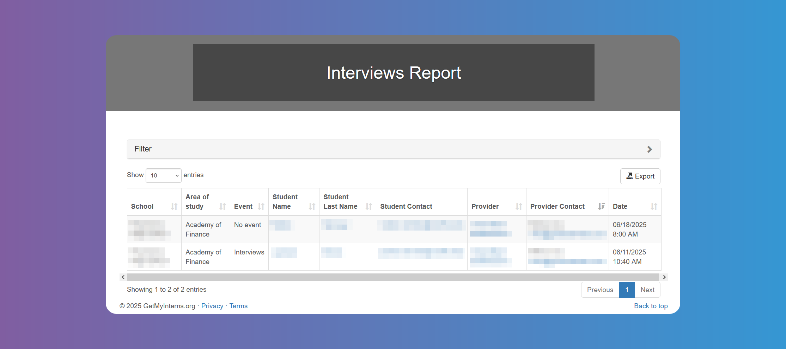
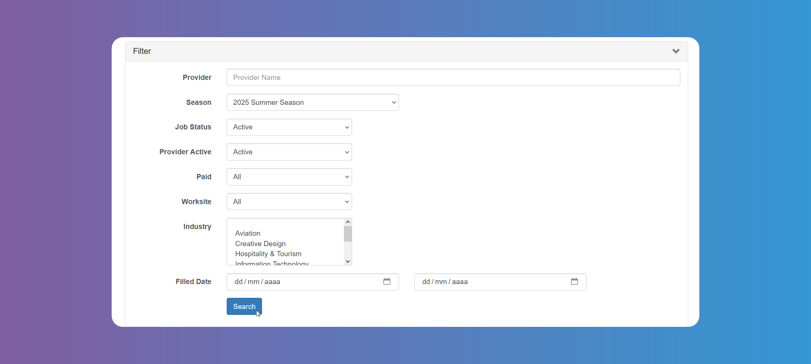
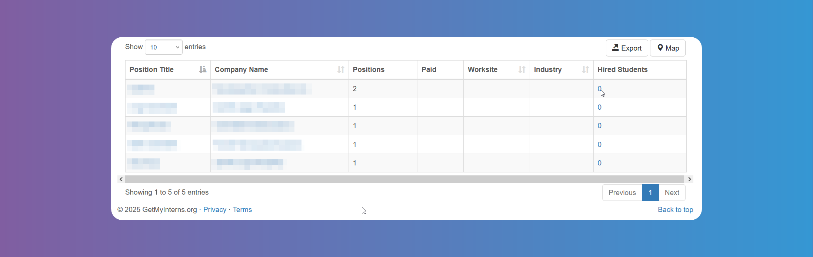
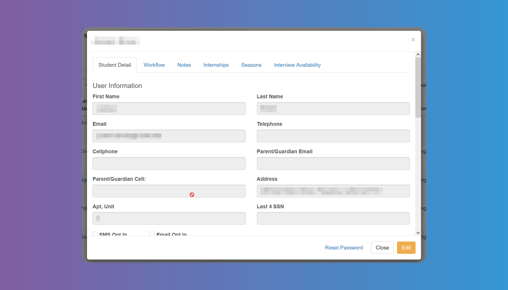
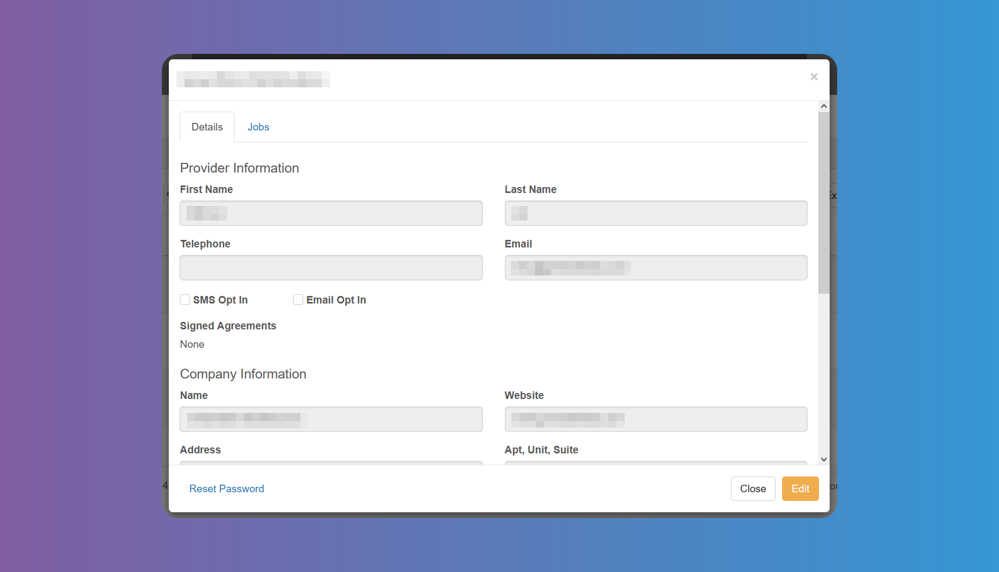
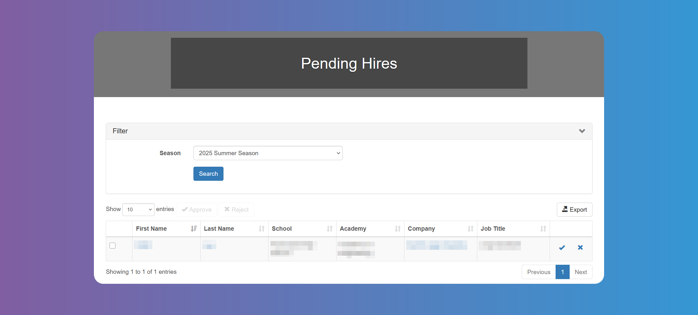
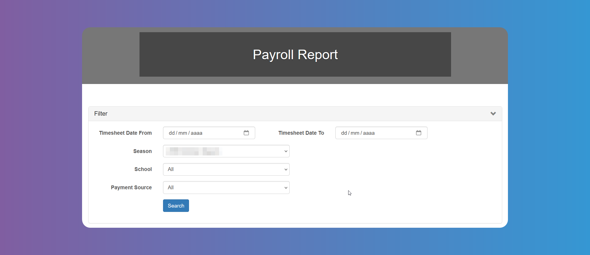

# Reports

## How to Run the Interviews Report

You can get a list of scheduled `Interviews` by `Season`, filtering by `School` and dates.

You can export the list if needed.

## How to Run the Jobs Report

You can get a list of `Jobs` using the filter.

You can export the list if needed. Tapping on the number of **_Hired Students_** will show you the `Student`'s name, `School` and hire date.

## How to Run the Students Report

You can get a list of all `Students` participating in the program. Use the filter to narrow the search by `Pending Students` or `School`, among other. Choose the columns you want to appear for your list. `Account Admins` can add a new `Student`. You can export the list if needed. Tap on the **_Map_** to see location distribution of registered `Students`.

Tapping on the `Student`'s first or last name will open a window with different tabs.

In the first tab you can view and **_Edit_** the `Student`'s details.

The `Workflow` tab will help you tick the previously filled criteria to approve a `Student` (See [System Configuration-Workflow](/school-admins/system-configuration#workflow-items))

There is a **_Notes_** tab to allow you to freely enter any text you may need.

You can see a list of `Internships` in the `Internships` tab, and approve or decline if necessary. `Account Admins` can also add an `Internship` yourself and notify the `Student` and `Internship Provider`.

On the `Seasons` tab, you can see the `Student`'s status for active `Seasons`, and approve or decline the `Student`.

You can see the `Student`'s **_Interview Availability_** for the active `Seasons` on the last tab.

At the bottom of the window you have the button to **_Reset Password_**, if needed.

## How to Run the Internship Providers Report

You can get a list of all `Internship Providers` participating in the program. Use the filter to narrow the search by `Seasons` or status, among other. Choose the columns you want to appear for your list. `Account Admins` can add a new `Internship Provider`. You can export the list if needed. Tap on the **_Map_** to see location distribution of registered `Internship Provider`.

Tapping on the `Internship Provider`'s name will open a window with two tabs.

In the first tab you can view and **_Edit_** the `Internship Provider`'s details. You can **_Approve_** or **_Decline_** the `Internship Provider` for each active `Season` from here.

In the `Jobs` tab you can see a list of `Jobs` offered by the `Internship Provider`. `Account Admins` can add a new `Job`. Tapping on the **_Position Title_** will show you the `Job`'s details, which `Account Admins` will be able to **_Edit_**. The eye icon at the last column will allow `Account Admins` to hide the `Job` offer from `Students`, if needed.

At the bottom of the window you have the button to **_Reset Password_**, if needed.

## How to Run the Students Placed Report

You can get a list of placed `Students`. Use the many filter fields to narrow the search and choose the columns you want to appear for your list.

You can export the list if needed. Tap on the **_Map_** to see location distribution of placed `Students`.

You can access the `Students` and `Internship Providers` details by tapping on their names (see details explanations on titles **How to run Students Reports** and **How to run Internship Providers Reports** above).

Tapping on the **_Edit_** button will allow `Account Admins` to edit the `Internship`'s details, **_Terminate_** or **_Withdraw_** it.

The checkbox enables the **_Assign Supervisor_** button.

## How to Run the Pending Hires Report

Choose the `Season` in the filter to get a list of pending hires. You can export the list if needed. You can **_Approve_** or **_Decline_** the hire on behalf of the `Student`.

You can access the `Students` and `Internship Providers` details by tapping on their names (see details explanations on titles **How to run Students Reports** and **How to run Internship Providers Reports** above).

## How to Run the Student Timesheets Report

You can use the many filter fields to search and view `Students Timesheets`, as long as you have chosen to **_Enable_** them from the [Settings-Timesheets](/school-admins/settings#timesheet-settings).

You can export or print details report if needed.

## How to Run the Payroll Report

You can get a `Payroll Report` by `Season`. Use the filters to narrow the search. You can export the list if needed.

## How to Run the Student Evaluations Report

You can get a `Students Evaluation Report` by `Season`. Use the filters to narrow the search. You can export the list, print or export details report, if needed.
