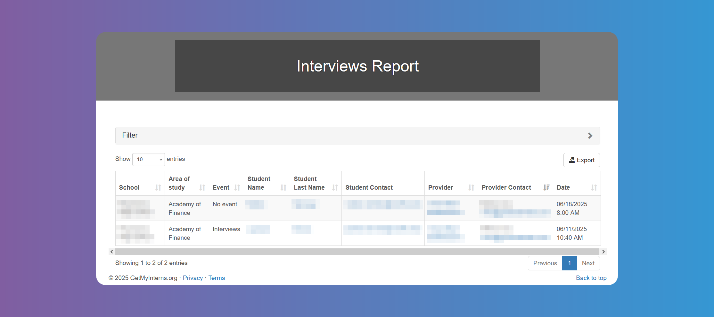

# Reports

## How to Run the Interviews Report

You can get a list of appointed `Interviews` by `Season`, filtering by `School` and dates.

You can export the list if needed.

## How to Run the Jobs Report

You can get a list of `Jobs` using the filter.

You can export the list if needed. Tapping on the number of **_Hired Students_** will show you the `Student`'s name, `School` and hire date.

## How to Run the Students Report

## How to Run the Internship Providers Report
## How to Run the Students Placed Report
## How to Run the Pending Hires Report
## How to Run the Student Timesheets Report
## How to Run the Payroll Report
## How to Run the Student Evaluations Report