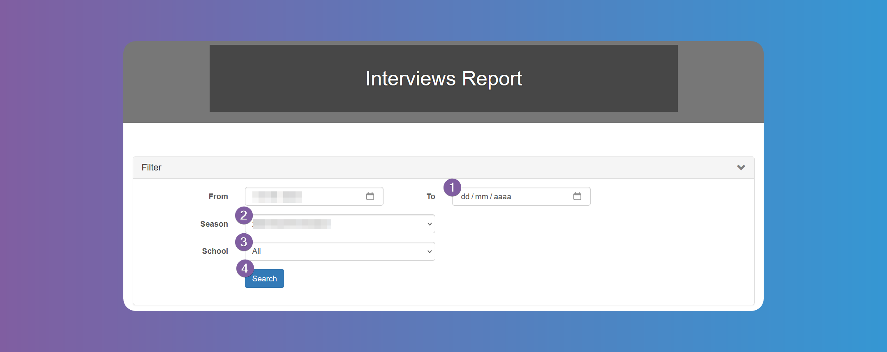
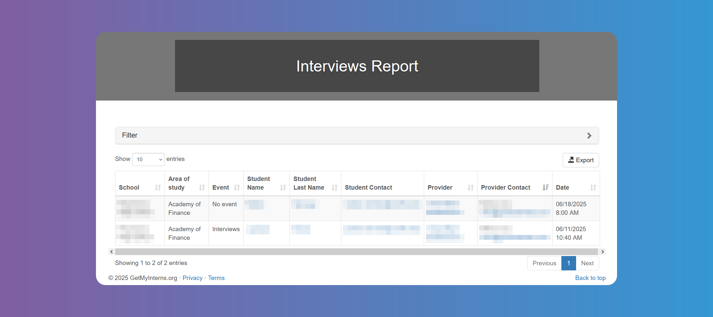
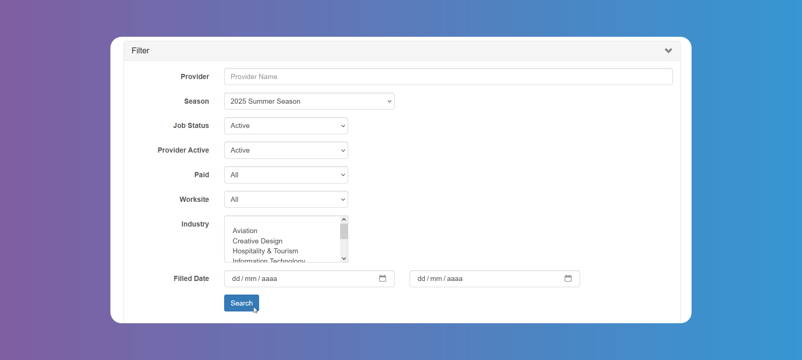
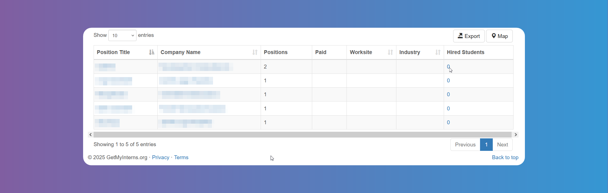
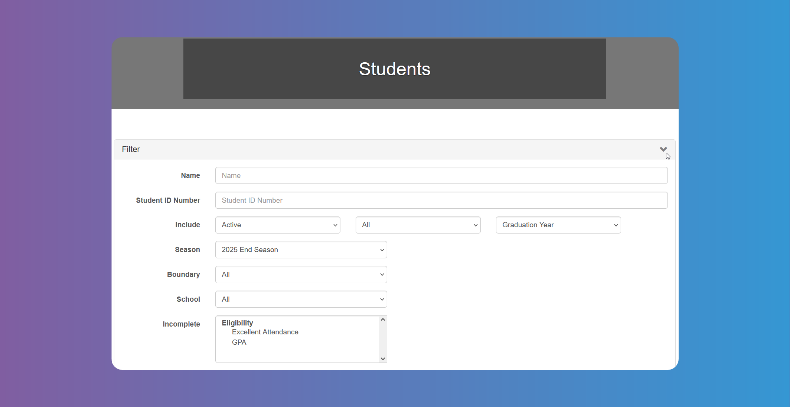
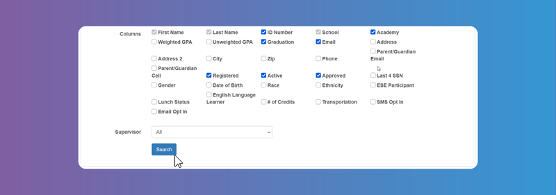
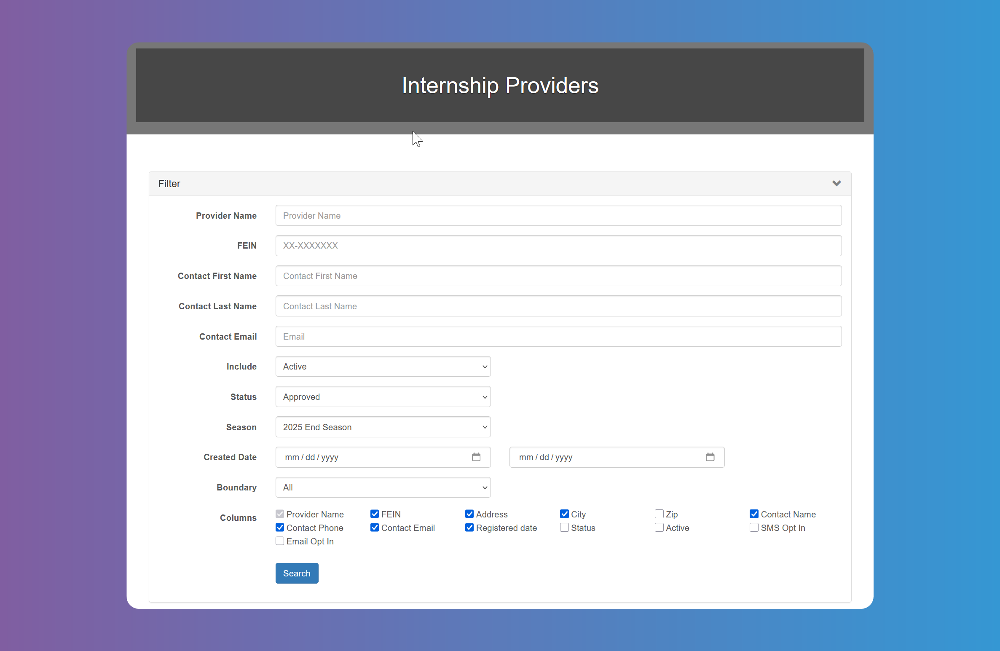
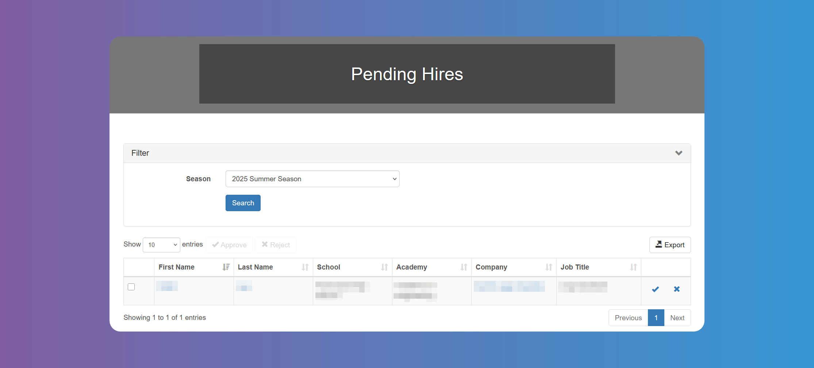
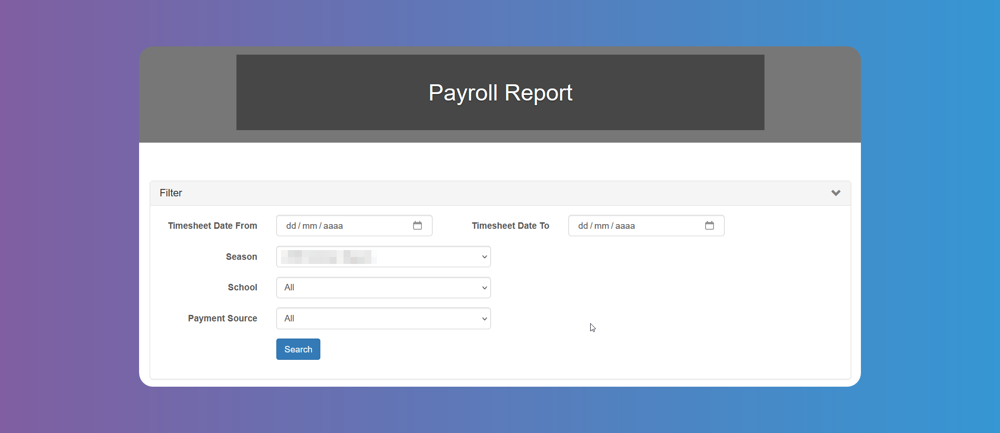

# Reports

## Interviews Report

You can get a list of scheduled `Interviews` by `Season`, filtering by `School` and dates.

You can export the list if needed.

## Jobs Report

You can get a list of `Jobs` using the filter.

You can export the list if needed. Tapping on the number of **_Hired Students_** will show you the list of hired students.

## Students Report

You can get a list of all `Students` participating in the program. Use the filter to narrow your search results as needed. Choose the columns you want to appear for your list. `Account Admins` can add a new `Student` and they will receive an email. You can export the list if needed. Tap on the **_Map_** to see location distribution of registered `Students`.

## Internship Providers Report

You can get a list of all `Internship Providers` participating in the program. Use the filter to narrow the search by `Seasons` or status, among other. Choose the columns you want to appear for your list. `Account Admins` can add a new `Internship Provider` and they will receive an email.

You can export the list if needed. Tap on the **_Map_** to see location distribution of registered `Internship Providers`.

## Students Placed Report

You can get a list of placed `Students`. These are all the students that have an approved/accepted internship. Use the many filter fields to narrow the search and choose the columns you want to appear for your list.

You can export the list if needed. Tap on the **_Map_** to see location distribution of placed `Students`.

You can access the `Students` and `Internship Providers` details by tapping on their names.

Tapping on the **_Edit_** button will allow `Account Admins` to edit the `Internship`'s details, **_Terminate_** or **_Withdraw_** the internship.

You can also batch assign supervisors by checking multiple students and clicking on the **_Assign Supervisor_** button. This will assign the student the chosen supervisor, which will give that Admin user access to the Student as well as the ability to filter all their students they are assigned to.

You can also assign a workplace supervisor from here if needed according to the [Timesheet Settings](/school-admins/settings/timesheet-settings) (see warning box in [Timesheets](/school-admins/Timesheets)).

## Pending Hires Report

This report allows you to see a list of `Students` that were offered an `Internship`, but were not accepted/approved yet. Choose the `Season` in the filter to get a list of pending hires. You can export the list if needed. You can **_Approve_** or **_Decline_** the hire on behalf of the `Student`. The `Student` and `Internship Provider` will receive an email stating the `Internship` has been approved or rejected.

You can access the `Students` and `Internship Providers` details by tapping on their names (see [Students Details Modal](/school-admins/students-details-modal) and [Internship Provider Details Modal](/school-admins/internship-providers-details-modal) for ore details).

## Student Timesheets Report

This report shows all the `Timesheets` in the system. You can use the many filter fields to search and view `Students Timesheets`, as long as you have chosen to **_Enable_** them from the [Timesheets Settings](/school-admins/settings/timesheet-settings).

You can export or print details report if needed.

## Payroll Report

This report will allow you to export a Payroll Report by calculating the total hours worked per `Student` and `Timesheet` given the selected filter criteria. You can export the report as needed to be imported into any other payroll system. This report is dependant of [Timesheets Settings](/school-admins/settings/timesheet-settings).

## Student Evaluations Report

This report will allow you to view all the evaluations by `Student` and period. It will allow you to view missing evaluations as well as completed ones. Use the filters to narrow the search. You can export the list, print or export details report, if needed.
