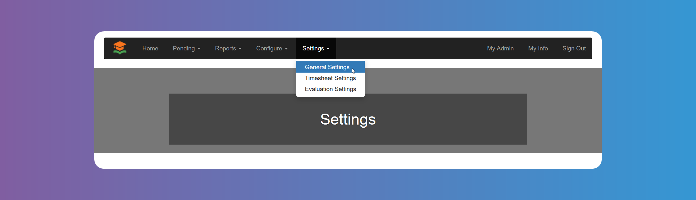

# Settings

:::warning

Remember to click on **_Save_** at the bottom of the screen when you finish each settings item.

:::

## General Settings

Manage your account preferences and customize your experience with ease. In `General Settings`, you can configure fundamental aspects of your GetMyInterns.org account to suit your needs. Take control and optimize your internship management experience effortlessly.

From `General Settings` you can:

**1.** Enable `Job` search

You can deactivate the `Job` search if needed.

**2.** Enable `Student` registration

You can disable `Student` registration if needed.

**3.** Enable `Student` approval

Enable this setting if you want the chosen admin roles in #9 below to manually approve all `Student` registrations. Otherwise, `Students` will be automatically approved after registering.

**4.** Enable Clever

You can choose to enable Clever so that `Students` can register to GetMyInterns using Clever single sing on.

**5.** Enable self service job placements

You can enable `Students` to accept `Jobs` proposals directly, without the need of approval. Bear in mind you need to also enable `Students` on point 8 below.

**6.** Enable `Internship Provider`agreement signature

You can choose to use Jotforms platform to upload the Agreement and make it available to be signed online by the `Internship Provider`.

**7.** Block offers to already placed `Students`

**8.** Set up approval and rejection roles

You can choose if a supervisor admin, supervisor and/or the `Student` can also approve or reject hires. For details about these admin users please see [System Configuration - Admin Users](/school-admins/system-configuration#admin-users).

**9.** Set up pending `Internship Providers` and `Students` approval roles

You can choose if a supervisor admin and/or supervisor can also approve pending `Internship Providers` and `Students`. For details about these admin users please see [System Configuration - Admin Users](/school-admins/system-configuration#admin-users).

**10.** Set up `Students` placements threshold

You can choose a number of internships to be informed by email when it has been reached.

## Timesheet Settings

Manage your `Timesheet` preferences. You can configure fundamental aspects of the approved internships to suit your needs.

From `Timesheet Settings` you can:

**1.** Enable `Timesheet`

**2.** Choose who approves the `Timesheet` and/or the order of approval

**3.** Set up workday specifics

- Enforce total breaks min length and select time in minutes
- Enforce workday total hours max length and select time in minutes

**4.** Set up breaks

- Set up Break 1 and choose time in minutes, if applicable
- Set up Break 2 and choose time in minutes, if applicable

**5.** Enable or require descriptions of each workday

**6.** Set up extra messages

Users will receive the default message shown in the image below for confirmation. But you can change it according to your needs.

- `Student` confirmation extra message before submission
- `Student` supervisor confirmation extra message before approval
- Workplace supervisor confirmation extra message before approval

## Evaluation Settings

Manage your `Evaluation` preferences for each `Season`.

**1.** Choose `Season`

**2.** Enable `Evaluations`

You can configure the questions for the evaluation clicking on the link (See [System Configuration - Evaluations](/school-admins/system-configuration#evaluations)).

**3.** Set up evaluation periods

- Quantity
- Name and dates
