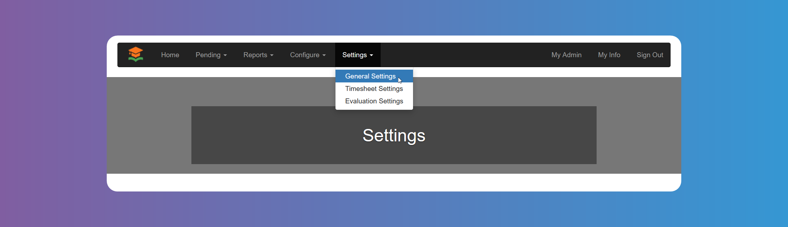

# General Settings

:::warning

Remember to click on **_Save_** at the bottom of the screen when you finish each settings item.

:::

Manage your account preferences and customize the platform through `General Settings`. You can configure fundamental aspects of your `GetMyInterns` account to suit your needs.

### Enable Job Search

You can control whether students can search for internships by enabling or disabling `Job Search`.

### Enable Student Registration

You can control whether students can register. For example, you might want to turn off `Student Registration` during off season to avoid confusion.

### Enable Student Approval

Enable this setting if you want the [chosen admin roles](#roles-allowed-to-approvedecline-pending-students) to manually approve all `Student` registrations. Otherwise, `Students` will be automatically approved after registering.

### Enable Clever

You can choose to enable Clever so that `Students` can register to GetMyInterns using Clever single sing on.

### Enable Self Service Job Placements

You can enable `Students` to accept `Job` offers directly, without the need of approval. Bear in mind you need to also enable `Students` on [Hire Approval Roles](#hire-approval-roles) and [Hire Rejection Roles](#hire-rejection-roles)

### Enable Internship Provider Agreement Signature

You can choose to use Jotforms platform to upload the Agreement and make it available to be signed online by the `Internship Provider`. When this is enabled and configured correctly, `Internship Providers` will see the uploaded agreement right after registration. Please note that signature of the agreement is not a requirement to approve an `Internship Provider`. It is up to the admin users to verify the agreement has been completed.

### Block Offers to Already Placed Students

When enabled, it prevents internship providers from offering a job to students already placed in an internship.

### Maximum Student Hires per Company

You can choose how many students at most an `Internship Provider` can hire. Leave it empty if you don't need to limit the number of `Students`hired by an `Internship Providers`.

In case you need to assign a different maximum to a specific `Internship Provider`, you can do so from the [`Internship Providers` details modal](/school-admins/internship-providers-details-modal).

### Hire Approval Roles

You can choose which admin role is allowed to accept job offers or whether `Students` can also accept them. For details about these admin users please see [System Configuration - Admin Users](/school-admins/system-configuration#admin-users).

### Hire Rejection Roles

You can choose which admin role is allowed to reject job offers or whether `Students` can also reject them. For details about these admin users please see [System Configuration - Admin Users](/school-admins/system-configuration#admin-users).

### Roles Allowed To Approve/Decline Pending Providers

You can choose which role is allowed to Approve or Decline pending `Internship Providers`. Account Admins, as the super admin, will always have access to do so. For details about these admin users please see [System Configuration - Admin Users](/school-admins/system-configuration#admin-users).

### Roles Allowed To Approve/Decline Pending Students

You can choose which role is allowed to Approve or Decline pending `Students`. Account Admins, as the super admin, will always have access to do so. For details about these admin users please see [System Configuration - Admin Users](/school-admins/system-configuration#admin-users).

### Limit Student Email Domains

Clicking on the box will allow you to add domains that `Students` will not be allowed to use to register to the platform.

### Students Placements Threshold

If you want to be informed via email when a number of placed students is reached, you can configure this setting. Please note you can have multiple thresholds. Only Account Admins will be notified.
