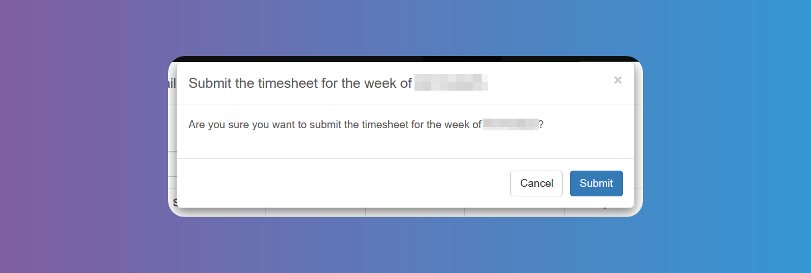

# Timesheet Settings

:::warning

Remember to click on **_Save_** at the bottom of the screen when you finish each settings item.

:::

Manage your `Timesheet` preferences.

### Enable Timesheets

Global flag to enable/disable timesheets.

### Approver(s)

You can configure who needs to approve the timesheets and in which order. You always need at least one approver:

- **Workplace Supervisor**: this could be `Internship Provider` user who signed up to the system or the one specified by the admin user through the [`Internship` detail modal](/school-admins/internships).
- **Student Supervisor**: this could be any Admin user who has access to the student or the one assigned through the [`Student` detail modal](/school-admins/students-details-modal).
- **First Workplace Supervisor and then Student Supervisor**: This specifies that the Workplace Supervisor will need to approve the timesheet first and then the Student Supervisor. The Student Supervisor won't be able to approve the timesheet until it is first approved by the Workplace Supervisor.
- **First Student Supervisor and then Workplace Supervisor**: This specifies that the Student Supervisor will need to approve the timesheet first and then the Workplace Supervisor. The Workplace Supervisor won't be able to approve the timesheet until it is first approved by the Student Supervisor.

### Workday

- **Enforce Total Breaks Min Length**: this setting makes sure that all breaks for the day add up to the specified `Total Breaks Min Length`.
- **Total Breaks Min Length**: the minimum number of minutes on a given day (accross all breaks) the student needs.
- **Enforce Workday Total Hours Max Length**: this setting makes sure that the `Workday Total Hours Max Length` is not surpassed.
- **Workday Total Hours Max Length**: the maximum number of minutes a student is allowed to work on a given day.

### Break 1

Setup whether the first break is enabled, required, and whether there should be an enforced minimum number of minutes for it.

### Break 2

Setup whether the second break is enabled, required, and whether there should be an enforced minimum number of minutes for it.

:::warning

Bear in mind the **Break** time will not be included in the total hours worked in the `Timesheet`.

:::

### Descriptions of Each Workday

Configure whether the `Student` will need to enter a description of what they worked on that day and whether it is required or not.

### Messages

Users will receive the default message shown in the image below for confirmation, but you can append any extra message according to your needs.

There are 3 extra messages you can configure:

- `Student` confirmation extra message before submission
- `Student` supervisor confirmation extra message before approval
- Workplace supervisor confirmation extra message before approval
