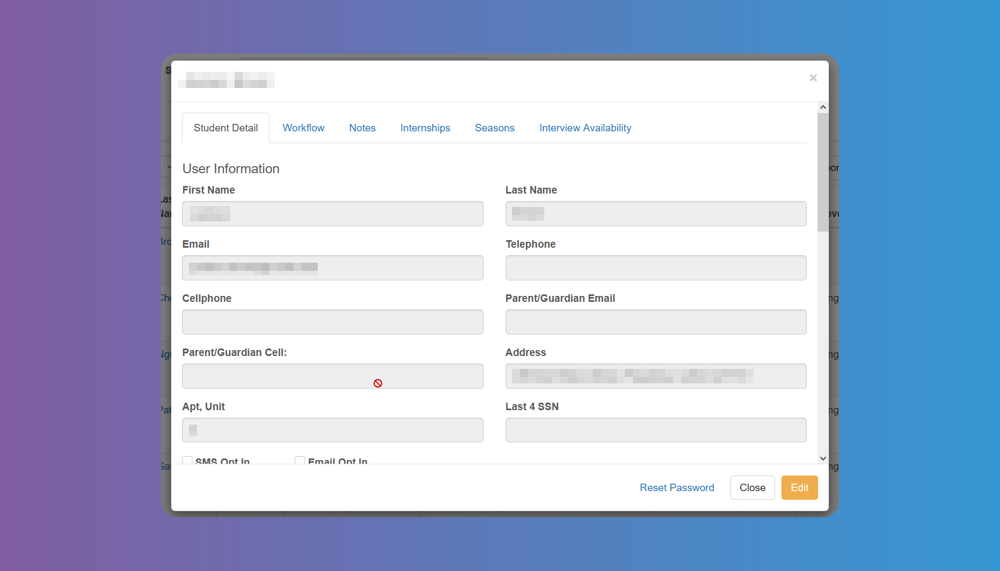

# Students Details Modal

Tapping on the `Student`'s first or last name anywhere on the platform where they appear clickable, will open the student's details with different tabs.

In the first tab you can view and Edit the `Student`'s details, according to the fields you have chosen on [System Configuration](/school-admins/system-configuration#configurable-student-fields).

The `Workflow` tab will help you tick the previously filled criteria to approve a `Student` (See [System Configuration-Workflow](/school-admins/system-configuration#workflow-items))

There is a **_Notes_** tab to allow you to freely enter any text you may need.

You can see a list of `Internships` in the `Internships` tab, and approve or decline if necessary. `Account Admins` can also add an `Internship` themselves and notify the `Student` and `Internship Provider`.

On the `Seasons` tab, you can see the `Student`'s status for active `Seasons`, and approve or decline the `Student`.

You can see the `Student`'s **_Interview Availability_** for the active `Seasons` on the last tab.

At the bottom of the window you have the button to **_Reset Password_**, if needed.
