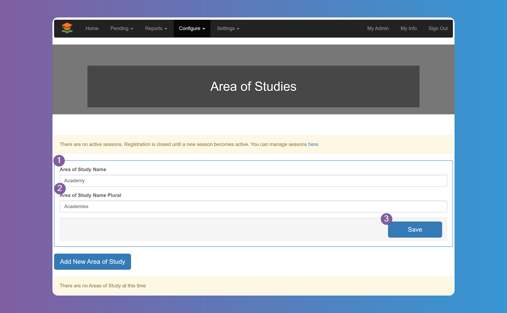
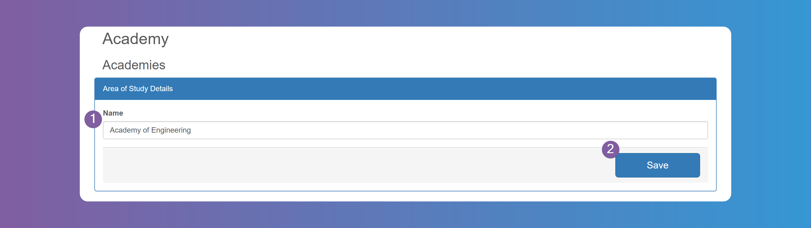
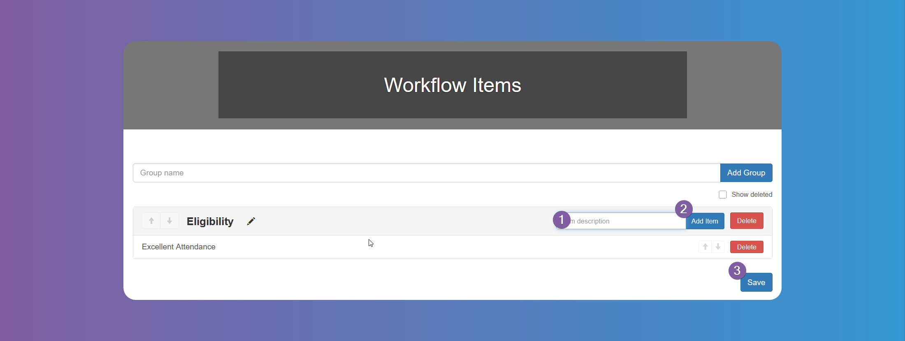
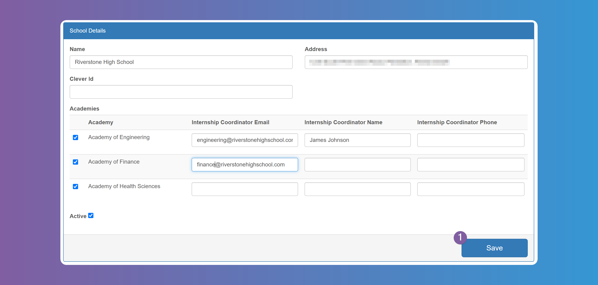
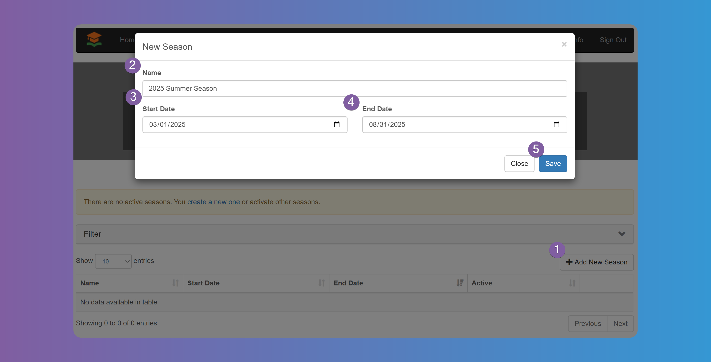
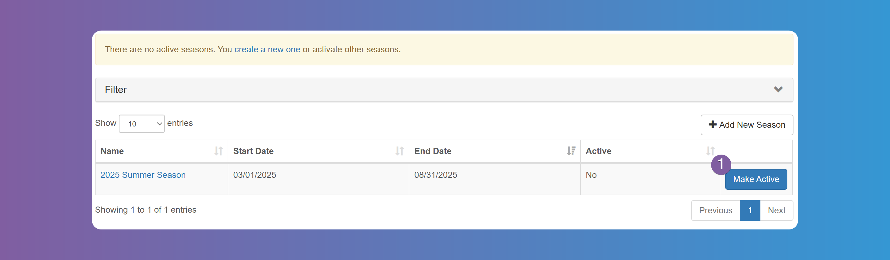
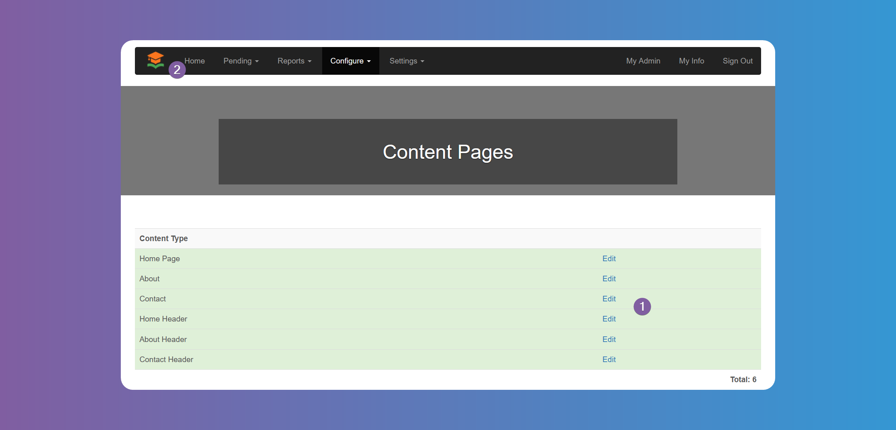
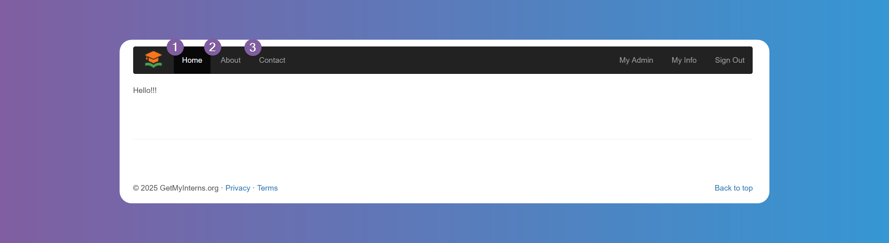
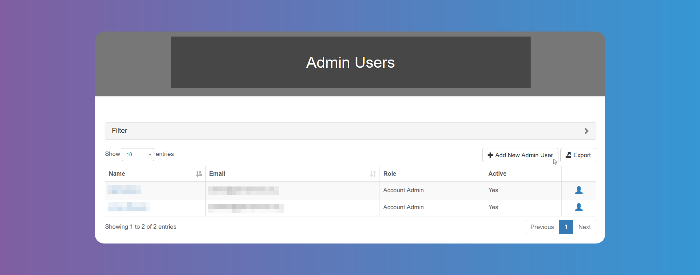
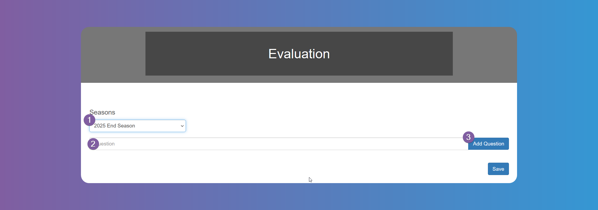

# System Configuration

:::warning

Remember to click on **_Save_** at the bottom of the screen when you finish each item, when needed.

:::

## Areas of Study

The `Area of Study` is a category or field in which students focus their academic and internship pursuits. At least one `Area of Study` is required. Since different schools/districts have different names for it, you can configure the name first. Some schools/districts call them `Academies`, `Pathways`, `Tracks`, `Concentrations`, etc. You will need to configure the singular and plural name for it first by going to **_Configure_** > **_Area of Studies_**

Next you need to add at least one `Area of Study` as it is a required field for when students sign up. You can have as many as you need. You will relate these `Area of Studies` to each `School`. Click on **_Add New Area of Study_** button, fill in the name, and click **_Save_**. Repeat this steps for as many `Areas of Studies` you need.

## Configurable Students Fields

Choose and set up the `Students` information according to your needs, by enabling the fields you want the `Students` to fill in, and choosing which fields are mandatory (required).

If you enable **_Data Sharing Consent_**, **_SMS Opt In_** or **_Email Opt In_**, you can edit the text to your liking and/or choose the default value, when applicable.

## Configurable Providers Fields

Choose and set up the `Internship Providers` information according to your needs, by enabling the fields you want the `Internship Providers` to fill in, and choosing which fields are mandatory (required).

If you enable **_SMS Opt In_** or **_Email Opt In_**, you can choose the default value.

## Workflow Items

If you have a process you follow to approve `Students`, you can use Workflow items to help you audit that process. See example below.

**1.** Start by naming the group and clicking on **_Add Group_**.

**2.** Choose the criteria for that group, by writing it on the box and clicking on **_Add Item_**.

**3.** Click on **_Save_** when you have completed all the groups and items.

:::info

You can check this criteria before approving `Students`, from the `Student`'s details `Workflow` tab (see [Manage Users - Students](/school-admins/managing-users#how-to-review-and-approve-student-accounts)). However, you can still approve the `Student` without checking this criteria.

:::

## Schools

You need to add all the schools that participate in your internship program, one by one and relate it to each `Area of Study` you have previously added. Go to **_Configure_** > **_Schools_** and press **_Add New School_**.

Enter the Name and Address, select the `Area of Studies` that this school is related to and specify the coordinator's email, name, and phone number for that `Area of Study` in that `School`. The email is used to let the coordinator know of every interview each student is scheduled for. Note that these values are optional and you can leave blank. When all done, click on **_Save_**. Repeat the steps for each school in your district.

:::info

Each `School` requires at least one `Area of Study` related to it. If some schools don't have an `Area of Study` you can create a generic `Other`, `Unknown`, etc `Area of Study` and relate it to that `School`.

:::

## Events

You can use this tool for any event in which `Internship Providers` can participate to interview `Students`. When scheduling interviews the active `Events` will appear as an option to hold the interviews.

## Seasons

`Seasons` are a designated period for internships. `Students`, `Internship Providers`, `Internships`, and everything related to them happens within the `Season`. `Students` and `Internship Providers` need to apply to each new `Season` in order to be able to participate within that period.

:::warning

The system requires to have at least one active `Season` in order for `Students` and `Internship Providers` to be able to register. If there isn't an active `Season` then registration is automatically disabled.

:::

To add a new `Season` go to **_Configure_** > **_Seasons_** and click on the **_Add New Season_** button. Specify a Name, Start and End Date.

:::info

The dates are not the dates the `Internships` take place, but rather the dates you want the users to start registering, want to find `Internships` and `Students` all the way through the actual `Internship` when `Students` submit `Timesheets` and `Providers` provide their `Evaluations`.

:::

After you have added the `Season`, you need to make it active by pressing the **_Make Active_** button.

:::info

You can only make a `Season` active as long as the dates are within today's date.

:::

:::info

You can have multiple `Seasons` active at the same time. Some Schools/Districts want to have `Seasons` overlap so `Students` can start registering for the next `Season` while the current `Season` is ongoing.

:::

## Grades

Set up the `Students` from which grades can participate in the program and the cut-off date.

## Industries

Set up the `Industries` for `Job` offers, according to your needs, from the given list.

:::info

Please let us know if you need other `Industries` to be added to the list. Refer to [How to contact support](/how-to-contact).

:::

## Content Pages

You can fill in the content you want to appear on **_Home_**, **_About_** and **_Contact_**.

## Forms

You can upload any forms you need the `Students` or `Internship Providers` to fill in and sign, and have them do that from the platform directly. Tap on **_Add New Form_** and fill in the fields. Tap on **_Examine_** to upload the form from your device.

## Admin Users

Add `Admin Users` according to your needs.

`Admin Users`can be one of 3 types, and this role must be chosen when adding a new `Admin User`:

- `Account Admin`: user has access to all features and configurations, all `Students` and `Internship Providers`.
- `Supervisor Admin`: user has access to all `Students` and `Internship Providers`, but cannot make changes to configurations.
- `Supervisor`: user has access only to the schools, `Areas of Study` and `Students` selected. This restriction can be selected herein.

You can also choose to send an email to the new `Admin User`.

## Evaluations

Set up the questions you will need an answer to, to evaluate the `Students`. Choose the answer to be free text, number, single select or multi select. Choose the text and values according to your needs.

:::info

You need to set up these questions for each `Season`.

:::

