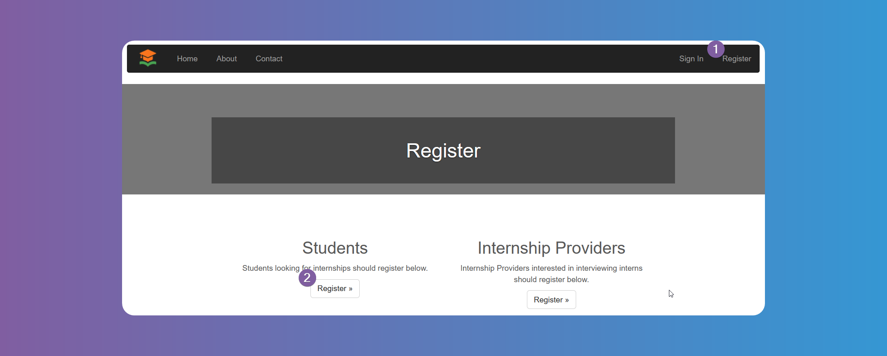
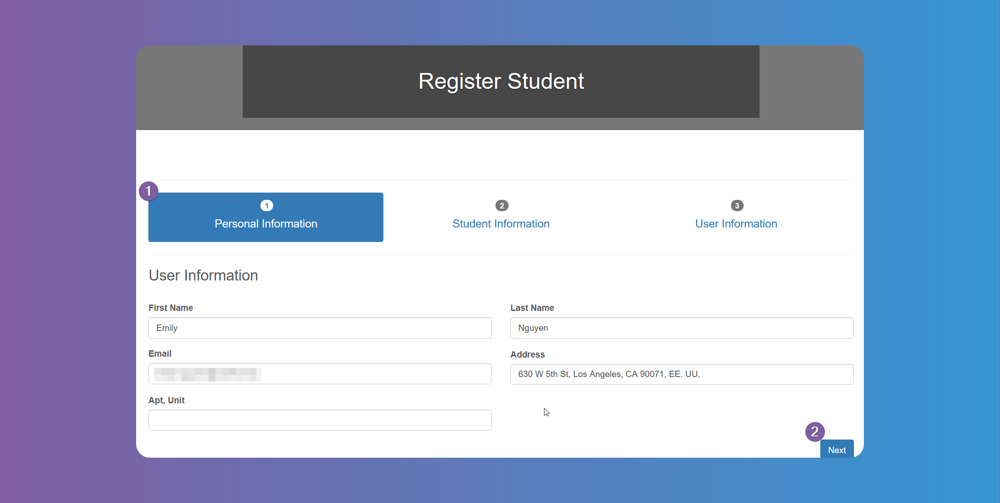
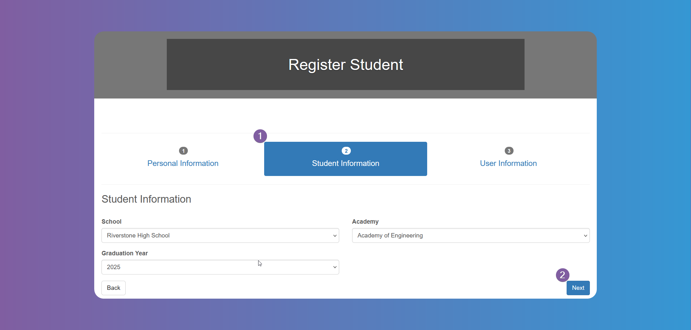
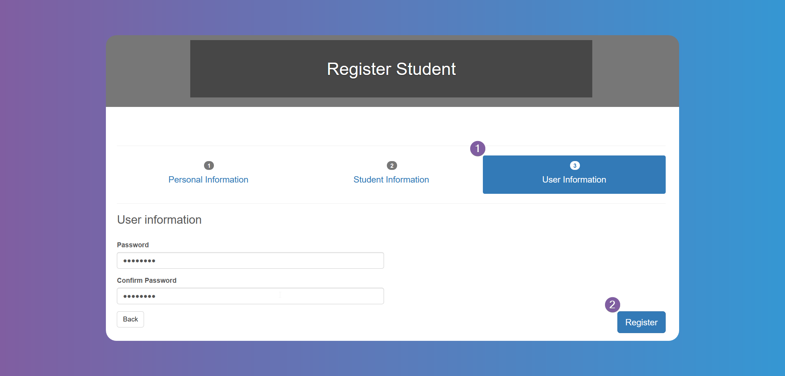
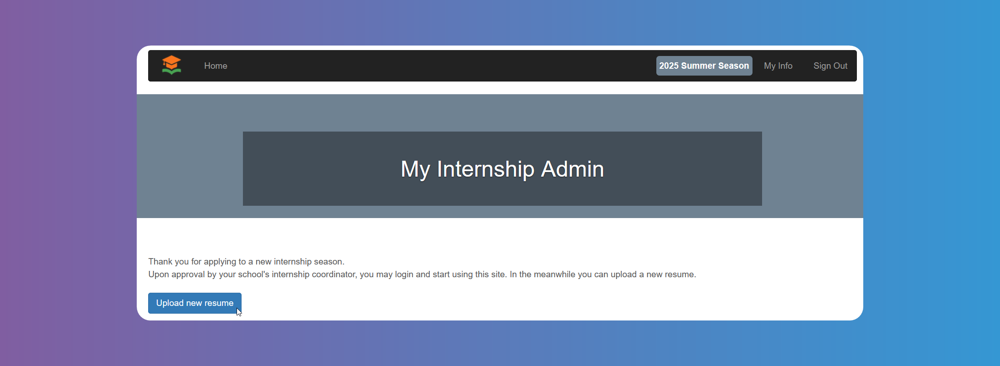
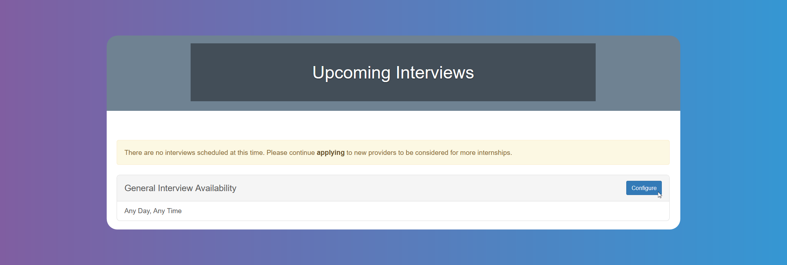
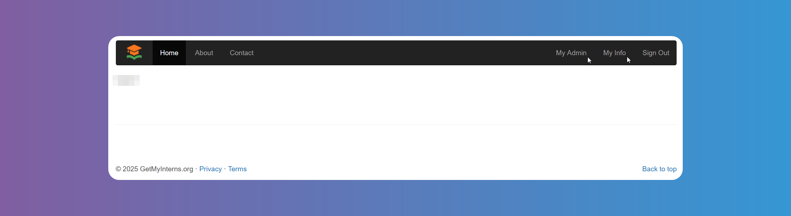
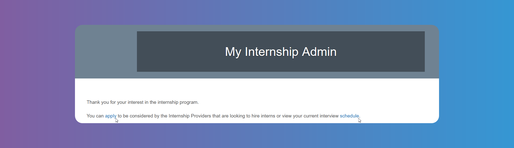

# Getting Started

## Welcome to GetMyInterns: A Guide for Students

Welcome to GetMyInterns! This guide will help you take your first steps.

Click on **_Register_** and then on `Students` to create your account. Fill in the required data as shown on the pictures below.

:::info

The **Academy** is an `Area of Study`, a category or field in which you focus your academic and internship pursuits. Since different schools/districts have different names for it, you may find a different name for the **Academy** field in the picture above. Some schools/districts call them `Academies`, `Pathways`, `Tracks`, `Concentrations`, etc.

:::

## How to Set Up Your Student Profile

After registering, you will need to wait for your school's coordinator to approve your registration. In the meantime you can upload your resume. `Internship Providers` will be able to see it.

:::info

If you don't see the message shown on the photo above, then you can start applying for a `Season` and using the platform directly.

:::

When your school's coordinator approves your registration, you will receive an email letting you know and you can click on the link and start setting up your profile, by choosing the `Season` first.

:::info

If there are more that one `Season` available, you will need to choose which `Season` to apply to. This will allow you to participate in the program during that `Season`. You can choose more than one by clicking on the `Season` shown at the top menu on the photo above.

:::

You will receive an email when your application for a `Season` has been approved.

Click on **_Upcoming Interviews_**, and configure your availability for interviews. `Internship Providers` will have access to this availability to schedule interviews with you.

## Navigating Your Student Dashboard

From the **_Home_** screen, click on **_My Info_** to edit your data or reset password, if needed.

Click on **_My Admin_** to see and use the `Students` menu.

You can toggle between active `Seasons` by clicking on the `Season` shown at the top right of the menu (see info box on **How to Set Up Your Student Profile** above). You can **_Apply_** to other `Seasons` from here.

When in an applied `Season`, you can directly click on **_Apply_** to find internships, or on **_Schedule_** to see already scheduled interviews.

If there are any **_Forms_** you need to fill out, click on **_Forms_** on the top menu and fill them out. You can ask your school's coordinator if you need to submit any forms appearing on this tab.

