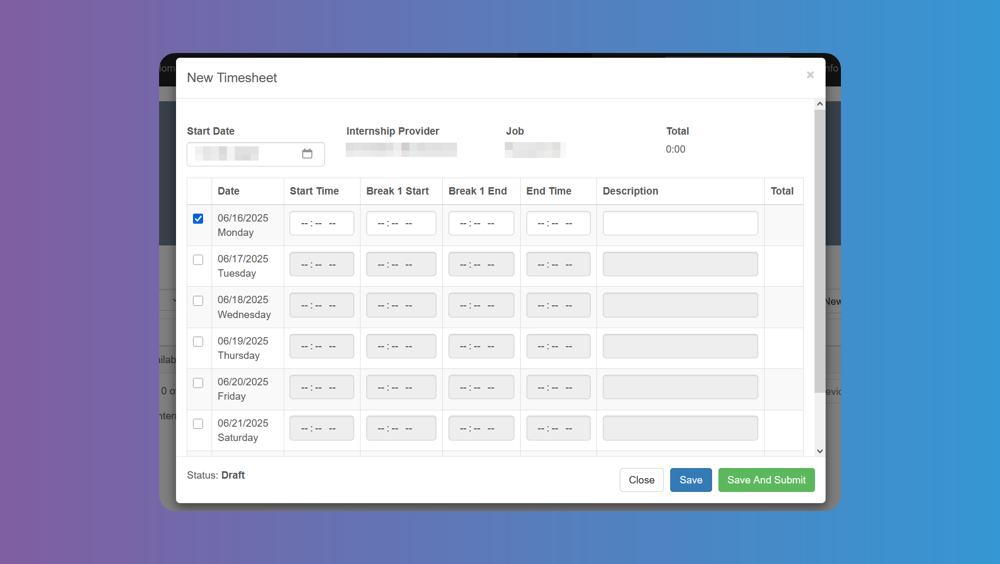

# Time Tracking

## How to Fill Out and Submit Your Timesheets

Click on **_Timesheets_** and then on **_Add New Timesheet_** to keep track of your `Internship` time data.

Enter the initial date of your `Internship` week and start filling in your data by ticking each date box. The columns to be filled may differ from the ones in the image, depending on the `Job` specifics.

Lastly click on **_Save_** or **_Save and Submit_**. Ask your school coordinator about the process (submitting every day, at the end of each week, month, etc.)

Ask your school coordinator about the specifics to fill in the **_Desccription_** (generic, specific hour by hour, etc).

## Viewing Past Timesheets and Statuses

Each `Timesheet`comprises a week of `Internship`. Just click on the dates of the week to open the details for such week. Click on **_Edit_** to keep filling in other empty days or change already filled in ones, and click on **_Save_** or **_Save and Submit_**. Edition is only available when the `Timesheet` has not been submitted yet.

You can see the Status at the bottom left corner.

Click on the **_Notes_** tab to check if there are any notes for you from your supervisor.